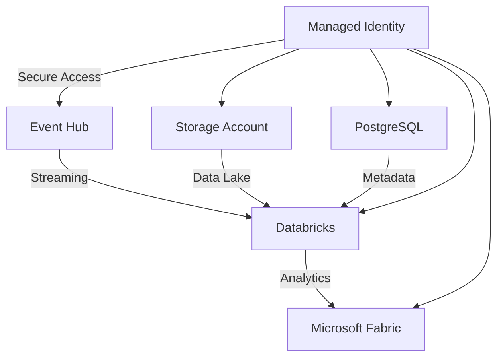

# 🚀 Data Governance With PURVIEW, FABRIC & DATABRICKS

[](https://azure.microsoft.com)
[](https://docs.microsoft.com/azure/azure-resource-manager/bicep/)
[]()

Data Governance platform with Microsoft Purview, Databricks Unity Catalog and Microsoft Fabric.

## 📊 About the Project

This is a complete **Data Governance** platform implemented on Azure using **Infrastructure as Code (Bicep/Terraform)**. The solution combines data storage, analytics, business intelligence, and real-time streaming.

### 🎯 Architecture



## 🛠️ Technologies Used

| Service | Purpose | SKU/Configuration |
|---------|-----------|------------------|
| **Azure Storage** | Data Lake (Bronze/Silver/Gold) | Standard_LRS |
| **Azure Databricks** | Analytics & ML | Standard/Premium |
| **Microsoft Fabric** | Business Intelligence | F2-F128 |
| **PostgreSQL** | Metadata Store | Flexible Server |
| **Event Hub** | Real-time Streaming | Standard/Premium |
| **Managed Identity** | Secure Authentication | User-assigned |

## � Recent Updates

### PostgreSQL Azure AD Administrator Configuration (August 2025)
The PostgreSQL module has been updated to properly handle Azure AD administrators. Previously, the module used the `guid()` function which could cause deployment errors. The new implementation uses the actual Object IDs of administrators.

**Key changes:**
- Added `azureAdAdministrators` parameter with Object ID support
- Maintained backward compatibility with the legacy approach
- Created detailed documentation for proper configuration

For migration instructions, see [PostgreSQL Azure AD Administrators](./docs/postgres-azure-ad-admins.md).

## �🚀 Quick Start

### 1. Prerequisites
```bash
# Verify installed tools
az --version        # Azure CLI
azd version         # Azure Developer CLI
```

### 2. Configuration
```bash
# Clone and navigate
git clone https://github.com/Azure/Data-Governance-with-Purview-Fabric-and-Databricks.git
cd Data-Governance-with-Purview-Fabric-and-Databricks

# Set up environment
azd env new
azd env set POSTGRES_ADMIN_USER pgadmin
azd env set POSTGRES_ADMIN_PASSWORD "YourSecurePassword!"
```

### 3. Deployment

#### Using Azure Developer CLI (AZD)
```bash
# Preview (optional)
azd provision --preview

# Complete deployment
azd provision
```

#### Using Azure CLI with Bicep
```bash
cd infra/bicep
az deployment sub create --name "dg-deployment" --location "eastus" --template-file "main.bicep" --parameters "main.bicepparam"
```

#### Using Terraform
```bash
cd infra/terraform
terraform init
terraform plan -var-file="environments/dev/terraform.tfvars"
terraform apply -var-file="environments/dev/terraform.tfvars" -auto-approve
```

## 📁 Repository Structure

```
📦 Data-Governance-with-Purview-Fabric-and-Databricks
 ┣ 📂 infra/                    # Infrastructure as Code
 ┃ ┣ 📂 bicep/                  # Modular Bicep templates
 ┃ ┃ ┣ 📂 modules/              # Resource modules
 ┃ ┃ ┃ ┣ 📜 storage.bicep       # Azure Storage
 ┃ ┃ ┃ ┣ 📜 databricks.bicep    # Databricks Workspace
 ┃ ┃ ┃ ┣ 📜 fabric.bicep        # Microsoft Fabric
 ┃ ┃ ┃ ┣ 📜 postgres.bicep      # PostgreSQL Server
 ┃ ┃ ┃ ┣ 📜 eventhub.bicep      # Event Hub
 ┃ ┃ ┃ ┗ 📜 identity.bicep      # Managed Identity
 ┃ ┃ ┣ 📂 types/
 ┃ ┃ ┃ ┗ 📜 common.bicep        # Type definitions
 ┃ ┃ ┣ 📜 main.bicep            # Main template
 ┃ ┃ ┣ 📜 main.bicepparam       # Typed parameters
 ┃ ┃ ┗ 📜 main.parameters.json  # AZD parameters
 ┃ ┗ 📂 terraform/              # Terraform templates
 ┃   ┣ 📜 main.tf               # Main configuration
 ┃   ┣ 📜 variables.tf          # Variables
 ┃   ┣ 📜 outputs.tf            # Outputs
 ┃   ┣ 📂 modules/              # Terraform modules
 ┃   ┗ 📂 environments/         # Environment-specific configurations
 ┣ 📂 docs/                     # Documentation
 ┃ ┣ 📜 deployment-guide.md     # Deployment guide (EN)
 ┃ ┗ 📜 postgres-azure-ad-admins.md # PostgreSQL AD admin configuration
 ┣ 📂 app/                      # Applications (future)
 ┣ 📜 azure.yaml                # AZD configuration
 ┗ 📜 README.md                 # This file

```

## ⚙️ Customizable Configurations

### 🏗️ Infrastructure

Edit `infra/bicep/main.bicepparam` to customize:

```bicep
// Microsoft Fabric
param fabricConfig = {
  skuName: 'F4'                     // F2, F4, F8, F16, F32, F64, F128
  adminUsers: ['admin@company.com'] // List of administrators
}

// Event Hub
param eventHubConfig = {
  skuName: 'Premium'                // Basic, Standard, Premium
  topicName: 'my-events'            // Topic name
  partitionCount: 4                 // Number of partitions
  messageRetentionInDays: 7         // Message retention
}

// Storage
param storageConfig = {
  skuName: 'Standard_GRS'           // Geo-redundant replication
  containers: ['bronze', 'silver', 'gold', 'raw'] // Custom containers
}

// PostgreSQL with Azure AD administrators
param postgresConfig = {
  // Other PostgreSQL configurations...
  azureAdAdministrators: [
    {
      objectId: '7fd6ef31-b70f-499f-b2da-668405acf2f4'  // Replace with actual Azure AD Object ID
      principalName: 'user@yourdomain.com'
      principalType: 'User'  // 'User' or 'Group'
    }
  ]
}
```

### 🔧 Environment

```bash
# Environment settings
azd env set POSTGRES_ADMIN_USER "myadmin"
azd env set POSTGRES_ADMIN_PASSWORD "MyP@ssw0rd123"

# Check settings
azd env get-values
```

## 📈 Use Cases

### 🎯 Data Lake Analytics
- **Ingestion**: Event Hub → Storage (Bronze)
- **Transformation**: Databricks (Bronze → Silver → Gold)
- **Visualization**: Microsoft Fabric dashboards

### 🔄 Real-time Processing
- **Streaming**: Event Hub with Kafka
- **Processing**: Databricks Structured Streaming
- **Storage**: Delta Lake format

### 📊 Business Intelligence
- **Data Source**: Storage Account (Gold layer)
- **Analytics**: Microsoft Fabric
- **Reports**: Power BI integration

## 🔒 Security

### 🛡️ Implemented
- ✅ **Managed Identity** for authentication
- ✅ **TLS 1.2** minimum on all services
- ✅ **Resource-level RBAC**
- ✅ **Secure parameter handling**

### 🔮 Security Roadmap
- 🔄 **Private Endpoints**
- 🔄 **VNet Integration**
- 🔄 **Key Vault integration**
- 🔄 **Data encryption at rest**

## 📋 Monitoring

### 📊 Available Metrics
```bash
# Infrastructure status
azd monitor

# Activity logs
az monitor activity-log list --resource-group [RG]

# Specific metrics
az monitor metrics list --resource [RESOURCE-ID]
```

### 🎯 Important KPIs
- **Event Hub**: Throughput, latency, errors
- **Databricks**: Job execution, cluster utilization
- **Storage**: Request rate, availability
- **PostgreSQL**: Connections, query performance

## 🔐 User Access Configuration

### PostgreSQL Azure AD Administrators

The PostgreSQL module supports Azure AD authentication for administrators. To configure Azure AD administrators:

1. **Get the Object IDs of administrators**:
   ```bash
   # Using Azure CLI
   az ad user show --id user@yourdomain.com --query objectId --output tsv
   
   # Using PowerShell
   Get-AzADUser -UserPrincipalName user@yourdomain.com | Select-Object -ExpandProperty Id
   ```

2. **Update the configuration in main.bicepparam**:
   ```bicep
   param postgresConfig = {
     // Other PostgreSQL configurations...
     azureAdAdministrators: [
       {
         objectId: 'user-object-id-guid'  // Replace with actual Azure AD Object ID
         principalName: 'user@yourdomain.com'
         principalType: 'User'  // 'User' or 'Group'
       }
     ]
   }
   ```

For more detailed instructions, see [PostgreSQL Azure AD Administrators](./docs/postgres-azure-ad-admins.md).

### Fabric Capacity Administrators

To set Fabric capacity administrators:

```bicep
param fabricConfig = {
  skuName: 'F4'
  adminUsers: [
    'admin@company.com',
    'admin-object-id-guid'  // Can use Object IDs or email addresses
  ]
}
```

## 🐛 Troubleshooting

### ❌ Common Issues

| Error | Cause | Solution |
|------|-------|---------|
| `InvalidTemplate` | Missing parameter | `azd env set PARAM value` |
| `Storage name invalid` | Name too long | Check naming conventions |
| `Quota exceeded` | Region limit | Request increase |
| `Permission denied` | Insufficient RBAC | Check roles |
| `Azure AD admin not found` | Invalid Object ID | Verify Object ID exists in tenant |

### 🔧 Useful Commands

```bash
# Complete reset
azd down --force --purge

# Template validation
az deployment group validate \
  --resource-group [RG] \
  --template-file main.bicep \
  --parameters @main.parameters.json

# Detailed debug
azd provision --debug
```

## 🎯 Roadmap

### 🚧 Upcoming Features

- [ ] **CI/CD Pipeline** (GitHub Actions)
- [ ] **Data Quality** monitoring
- [ ] **Automated testing** infrastructure
- [ ] **Cost optimization** insights
- [ ] **Multi-environment** support
- [ ] **Backup & Disaster Recovery**

### 📈 Planned Improvements

- [ ] **Private networking** implementation
- [ ] **Advanced security** (Key Vault, encryption)
- [ ] **Observability** (Application Insights)
- [ ] **Auto-scaling** policies
- [ ] **Data cataloging** automation

## 📞 Support

### 📚 Documentation
- [Deployment Guide](./docs/deployment-guide.md)
- [PostgreSQL Azure AD Administrators](./docs/postgres-azure-ad-admins.md)
- [Azure Bicep Documentation](https://docs.microsoft.com/azure/azure-resource-manager/bicep/)
- [Azure Terraform Provider](https://registry.terraform.io/providers/hashicorp/azurerm/latest)

### 🆘 Issues
- Open an [Issue](../../issues) for bugs
- Use [Discussions](../../discussions) for questions
- Check the documentation for troubleshooting

## 📄 License

This project is licensed under the **MIT License** - see the [LICENSE](LICENSE) file for details.

## Deployment Methods Comparison

### Azure Developer CLI (AZD)
- **Best for**: Development teams, simpler deployments
- **Prerequisites**: Azure Developer CLI installed
- **Command**: `azd provision`
- **Advantages**: Simplified developer experience, environment management
- **Documentation**: [Azure Developer CLI](https://learn.microsoft.com/azure/developer/azure-developer-cli/)

### Azure CLI with Bicep
- **Best for**: Infrastructure teams, CI/CD pipelines
- **Prerequisites**: Azure CLI with Bicep extension
- **Command**: `az deployment sub create --template-file main.bicep`
- **Advantages**: More control, direct integration with Azure CLI
- **Documentation**: [Azure Bicep](https://learn.microsoft.com/azure/azure-resource-manager/bicep/)

### Terraform
- **Best for**: Multi-cloud environments, teams already using Terraform
- **Prerequisites**: Terraform CLI installed
- **Command**: `terraform apply`
- **Advantages**: Multi-cloud support, state management
- **Documentation**: [Azure Terraform Provider](https://registry.terraform.io/providers/hashicorp/azurerm/latest)

---

<div align="center">

**🚀 Developed with ❤️ for the Azure community**

[](https://azure.microsoft.com)
[](https://docs.microsoft.com/azure/azure-resource-manager/bicep/)

</div>

## Contributing

This project welcomes contributions and suggestions.  Most contributions require you to agree to a
Contributor License Agreement (CLA) declaring that you have the right to, and actually do, grant us
the rights to use your contribution. For details, visit [Contributor License Agreements](https://cla.opensource.microsoft.com).

When you submit a pull request, a CLA bot will automatically determine whether you need to provide
a CLA and decorate the PR appropriately (e.g., status check, comment). Simply follow the instructions
provided by the bot. You will only need to do this once across all repos using our CLA.

This project has adopted the [Microsoft Open Source Code of Conduct](https://opensource.microsoft.com/codeofconduct/).
For more information see the [Code of Conduct FAQ](https://opensource.microsoft.com/codeofconduct/faq/) or
contact [opencode@microsoft.com](mailto:opencode@microsoft.com) with any additional questions or comments.

## Trademarks

This project may contain trademarks or logos for projects, products, or services. Authorized use of Microsoft
trademarks or logos is subject to and must follow
[Microsoft's Trademark & Brand Guidelines](https://www.microsoft.com/legal/intellectualproperty/trademarks/usage/general).
Use of Microsoft trademarks or logos in modified versions of this project must not cause confusion or imply Microsoft sponsorship.
Any use of third-party trademarks or logos are subject to those third-party's policies.
