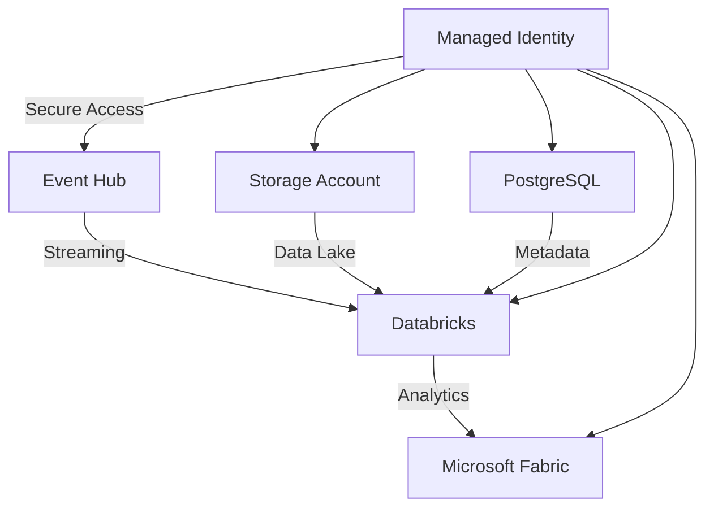

````markdown
# 🚀 Plataforma de Governança de Dados - Azure

[](https://azure.microsoft.com)
[](https://docs.microsoft.com/azure/azure-resource-manager/bicep/)
[]()

## 📊 Sobre o Projeto

Esta é uma plataforma completa de **Governança de Dados** implementada no Azure usando **Infrastructure as Code (Bicep)**. A solução combina armazenamento de dados, análise, business intelligence e streaming em tempo real.

### 🎯 Arquitetura



## 🛠️ Tecnologias Utilizadas

| Serviço | Propósito | SKU/Configuração |
|---------|-----------|------------------|
| **Azure Storage** | Data Lake (Bronze/Silver/Gold) | Standard_LRS |
| **Azure Databricks** | Analytics & ML | Standard/Premium |
| **Microsoft Fabric** | Business Intelligence | F2-F128 |
| **PostgreSQL** | Metadata Store | Flexible Server |
| **Event Hub** | Real-time Streaming | Standard/Premium |
| **Managed Identity** | Secure Authentication | User-assigned |

## 🚀 Quick Start

### 1. Pré-requisitos
```bash
# Verificar ferramentas instaladas
az --version        # Azure CLI
azd version         # Azure Developer CLI
```

### 2. Configuração
```bash
# Clonar e navegar
git clone <repo-url>
cd Data-Governance-with-Purview-Fabric-and-Databricks

# Configurar ambiente
azd env new
azd env set POSTGRES_ADMIN_USER pgadmin
azd env set POSTGRES_ADMIN_PASSWORD "DataGov2024!"
```

### 3. Deploy
```bash
# Preview (opcional)
azd provision --preview

# Deploy completo
azd provision
```

## 📁 Estrutura do Repositório

```
📦 Data-Governance-with-Purview-Fabric-and-Databricks
 ┣ 📂 infra/                    # Infrastructure as Code
 ┃ ┣ 📂 bicep/                  # Templates Bicep modulares
 ┃ ┃ ┣ 📂 modules/              # Módulos de recursos
 ┃ ┃ ┃ ┣ 📜 storage.bicep       # Azure Storage
 ┃ ┃ ┃ ┣ 📜 databricks.bicep    # Databricks Workspace
 ┃ ┃ ┃ ┣ 📜 fabric.bicep        # Microsoft Fabric
 ┃ ┃ ┃ ┣ 📜 postgres.bicep      # PostgreSQL Server
 ┃ ┃ ┃ ┣ 📜 eventhub.bicep      # Event Hub
 ┃ ┃ ┃ ┗ 📜 identity.bicep      # Managed Identity
 ┃ ┃ ┣ 📂 types/
 ┃ ┃ ┃ ┗ 📜 common.bicep        # Definições de tipos
 ┃ ┃ ┣ 📜 main.bicep            # Template principal
 ┃ ┃ ┣ 📜 main.bicepparam       # Parâmetros tipados
 ┃ ┃ ┗ 📜 main.parameters.json  # Parâmetros AZD
 ┃ ┗ 📜 main.bicep              # Template raiz alternativo
 ┣ 📂 docs/                     # Documentação
 ┃ ┣ 📜 guia-implementacao-ptbr.md # Guia completo (PT-BR)
 ┃ ┗ 📜 deployment-guide.md     # Guia de deployment (EN)
 ┣ 📂 app/                      # Aplicações (futuro)
 ┣ 📜 azure.yaml                # Configuração AZD
 ┗ 📜 README-PTBR.md            # Este arquivo
```

## ⚙️ Configurações Personalizáveis

### 🏗️ Infraestrutura

Edite `infra/bicep/main.bicepparam` para personalizar:

```bicep
// Microsoft Fabric
param fabricConfig = {
  skuName: 'F4'                    // F2, F4, F8, F16, F32, F64, F128
  adminUsers: ['admin@empresa.com'] // Lista de administradores
}

// Event Hub
param eventHubConfig = {
  skuName: 'Premium'                    // Basic, Standard, Premium
  topicName: 'meus-eventos'             // Nome do tópico
  partitionCount: 4                     // Número de partições
  messageRetentionInDays: 7             // Retenção de mensagens
}

// Storage
param storageConfig = {
  skuName: 'Standard_GRS'               // Replicação geo-redundante
  containers: ['bronze', 'silver', 'gold', 'raw'] // Containers customizados
}
```

### 🔧 Ambiente

```bash
# Configurações de ambiente
azd env set POSTGRES_ADMIN_USER "meuadmin"
azd env set POSTGRES_ADMIN_PASSWORD "MinhaSenh@123"

# Verificar configurações
azd env get-values
```

## 📈 Casos de Uso

### 🎯 Data Lake Analytics
- **Ingestão**: Event Hub → Storage (Bronze)
- **Transformação**: Databricks (Bronze → Silver → Gold)
- **Visualização**: Microsoft Fabric dashboards

### 🔄 Real-time Processing
- **Streaming**: Event Hub com Kafka
- **Processing**: Databricks Structured Streaming
- **Storage**: Delta Lake format

### 📊 Business Intelligence
- **Data Source**: Storage Account (Gold layer)
- **Analytics**: Microsoft Fabric
- **Reports**: Power BI integration

## 🔒 Segurança

### 🛡️ Implementado
- ✅ **Managed Identity** para autenticação
- ✅ **TLS 1.2** mínimo em todos os serviços
- ✅ **Resource-level RBAC**
- ✅ **Secure parameter handling**

### 🔮 Roadmap Segurança
- 🔄 **Private Endpoints**
- 🔄 **VNet Integration**
- 🔄 **Key Vault integration**
- 🔄 **Data encryption at rest**

## 📋 Monitoramento

### 📊 Métricas Disponíveis
```bash
# Status da infraestrutura
azd monitor

# Logs de atividade
az monitor activity-log list --resource-group [RG]

# Métricas específicas
az monitor metrics list --resource [RESOURCE-ID]
```

### 🎯 KPIs Importantes
- **Event Hub**: Throughput, latência, erros
- **Databricks**: Job execution, cluster utilization
- **Storage**: Request rate, availability
- **PostgreSQL**: Connections, query performance

## 🐛 Troubleshooting

### ❌ Problemas Comuns

| Erro | Causa | Solução |
|------|-------|---------|
| `InvalidTemplate` | Parâmetro não fornecido | `azd env set PARAM value` |
| `Storage name invalid` | Nome muito longo | Verificar convenções |
| `Quota exceeded` | Limite da região | Solicitar aumento |
| `Permission denied` | RBAC insuficiente | Verificar roles |

### 🔧 Comandos Úteis

```bash
# Reset completo
azd down --force --purge

# Validação de template
az deployment group validate \
  --resource-group [RG] \
  --template-file main.bicep \
  --parameters @main.parameters.json

# Debug detalhado
azd provision --debug
```

## 🎯 Roadmap

### 🚧 Próximas Funcionalidades

- [ ] **CI/CD Pipeline** (GitHub Actions)
- [ ] **Data Quality** monitoring
- [ ] **Automated testing** infrastructure
- [ ] **Cost optimization** insights
- [ ] **Multi-environment** support
- [ ] **Backup & Disaster Recovery**

### 📈 Melhorias Planejadas

- [ ] **Private networking** implementation
- [ ] **Advanced security** (Key Vault, encryption)
- [ ] **Observability** (Application Insights)
- [ ] **Auto-scaling** policies
- [ ] **Data cataloging** automation

## 🤝 Contribuindo

### 🛠️ Desenvolvimento

1. **Fork** o repositório
2. **Create** feature branch (`git checkout -b feature/nova-funcionalidade`)
3. **Commit** changes (`git commit -am 'Add nova funcionalidade'`)
4. **Push** to branch (`git push origin feature/nova-funcionalidade`)
5. **Create** Pull Request

### 📝 Documentação

Contribuições para documentação são muito bem-vindas! Especialmente:
- Tutoriais de uso
- Exemplos de código
- Troubleshooting guides
- Traduções

## 📞 Suporte

### 📚 Documentação
- [Guia Completo (PT-BR)](./docs/guia-implementacao-ptbr.md)
- [Deployment Guide (EN)](./docs/deployment-guide.md)
- [Azure Bicep Docs](https://docs.microsoft.com/azure/azure-resource-manager/bicep/)

### 🆘 Problemas
- Abra uma [Issue](../../issues) para bugs
- Use [Discussions](../../discussions) para dúvidas
- Consulte [FAQ](./docs/guia-implementacao-ptbr.md#troubleshooting)

## 📄 Licença

Este projeto está licenciado sob a **MIT License** - veja o arquivo [LICENSE](LICENSE) para detalhes.

---

<div align="center">

**🚀 Desenvolvido com ❤️ para a comunidade Azure**

[](https://azure.microsoft.com)
[](https://docs.microsoft.com/azure/azure-resource-manager/bicep/)

</div>

````
