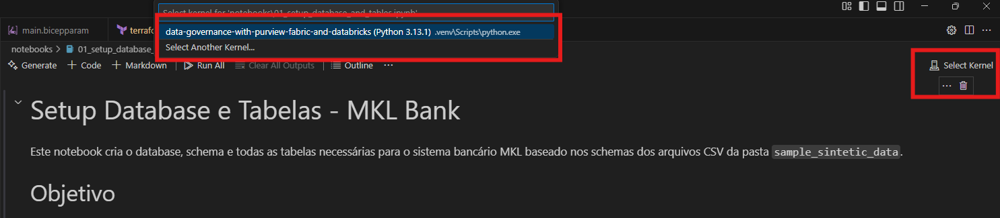

# Quick Start Guide

Guia de inicio rápido 

## Introdução 

Siga as etapas descritas neste guia para poder realizar o deploy da infraestrutura para uso. 
Antes de iniciar recomendo olhar a descrição do projeto no [Readme.md](../README.md) principal do repositorio.

## Etapas 
Para aprendizado e teste existem as seguintes etapas:  

- Preparar as dependencias
- Execução dos notebooks de ingestão dos dados.
- Criação do Lakehouse no Databricks
- Criação da Camada Semantica no Fabric
- Criação de Dashboard no Power BI
(Opciomal)
- Criação de um Data Agent no Fabric
- Criação de um relatorio em tempo real

### Preparar as Dependencias
[Referencias aqui](../README.md#-quick-start)
- Criação de uma assinatura na Azure ou uso de uma existente
- Instalação do `az cli`, `azd cli`, `terraform`(opcional), `uv`, `bicep addin para vscode`.
- Instalação das bibliotecas python necessárias para uso dos notebooks (basta dar um `uv sync`)
- Executar o `.venv\Scripts\activate`(windows) ou `source .venv/bin/activate`(mac/linux)
- Criação da Infraestrutura (via azd up ou addin do vscode).

Caso use o plugin do bicep terá uma tela pareceida com a imagem abaixo.

### Execução dos notebooks de ingestão dos dados
Ao abrir o primeiro notebook selecione o kernel que foi feita a ativação

- Inserção dos dados no Banco. [Referencia](../notebooks/01_setup_database_and_tables.ipynb)
Antes adicione seu IP nas regras de rede. 

- (Opcional) Criar mais dados sinteticos [Referencia](../notebooks/08_add_client_account_pix.ipynb)
- (Opcional) Enviar dados em real time para o Eventhub

### Criação do Lakehouse no Databricks

- Acessar ao Databricks e subir os notebooks de ingestão e transformação.
- Verificar os notebooks e executar eles.
- Criar via Genie as descrições das tabelas no Unity Catalog.

### Criação da Camada Semantica no Fabric
- Criar um workspace no Microsoft Fabric.
- Criar um Lakehouse para acessar aos dados da gold layer do Databricks.
- (Opcional) Criar um Data Agent
- (Opcional) Criar um eventhouse e eventstream para pegar dados em real time do eventhub.

### Criação de Dashboard no Power BI
- Criar um dashboard no Power BI
- (Opcional) Criar um dashboard em real time no PBI
- (Opcional) Integrar um web chat com AI no dashboard do PBI.

